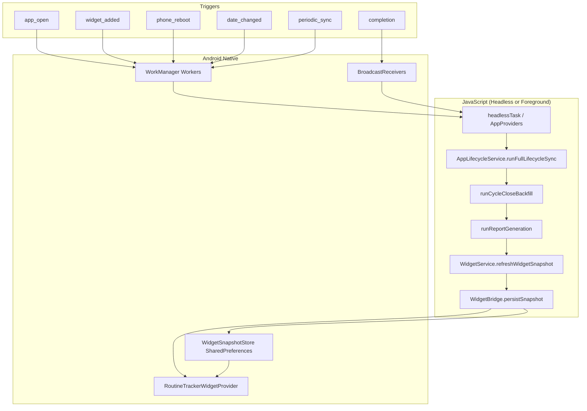

# Widget Architecture (Frozen — V1 Android)

Derived from [PROJECT_SPEC.md](./PROJECT_SPEC.md), [APP_FLOW.md](./APP_FLOW.md) §8, and [BUSINESS_LOGIC.md](./BUSINESS_LOGIC.md).

---

## Core invariant (frozen before Phase 5C)

**WidgetSnapshot must never be generated from stale lifecycle state.**

| Path | Allowed |
|------|---------|
| `runFullLifecycleSync()` → cycle close **success** → report generation → `refreshWidgetSnapshot()` | ✅ |
| `runFullLifecycleSync()` → cycle close **failure** → `refreshWidgetSnapshot()` | ❌ |
| Direct call to `widgetService.refreshWidgetSnapshot()` without open snapshot gate | ❌ |

Enforcement:

1. `AppLifecycleService` opens the snapshot gate only after `runCycleCloseBackfill()` succeeds.
2. `WidgetService.refreshWidgetSnapshot()` calls `assertSnapshotGateOpen()` before building.
3. Gate closes in `finally` after snapshot attempt.

The native widget **reads only** the persisted snapshot. It never runs business logic or SQLite queries.

---

## System diagram



---

## Lifecycle rule (every trigger)

```
runFullLifecycleSync(trigger)
    ↓
runCycleCloseBackfill()     ← failure aborts; snapshot gate stays closed
    ↓
runReportGeneration()       ← per-activity errors collected; continues
    ↓
refreshWidgetSnapshot()     ← only if snapshot gate open
    ↓
WidgetBridge.updateWidget() ← native AppWidgetManager.updateAppWidget
```

Widget refresh = **mini app launch**.

---

## Completion (checkbox, no app open)

```
Checkbox tap
    ↓
WidgetCompleteReceiver
    ↓
WidgetCompletionHeadlessService (Headless JS)
    ↓
bootstrapDatabase()
    ↓
activityLogService.recordCompletion(activityId)
    ↓
runFullLifecycleSync('completion')
```

---

## File structure

```
RoutineTracker/
├── app.json                              # config plugin registration
├── index.ts                              # headless task registration
├── docs/
│   └── WIDGET_ARCHITECTURE.md            # this document
├── plugins/
│   └── withRoutineTrackerWidget/
│       ├── app.plugin.js                 # Expo config plugin
│       └── android-src/                  # copied into android/ on prebuild
│           ├── java/com/routinetracker/widget/
│           │   ├── RoutineTrackerWidgetModule.kt      # RN bridge
│           │   ├── RoutineTrackerWidgetPackage.kt
│           │   ├── RoutineTrackerWidgetProvider.kt    # AppWidgetProvider
│           │   ├── WidgetSnapshotStore.kt               # SharedPreferences
│           │   ├── WidgetSyncScheduler.kt              # WorkManager + alarms
│           │   ├── WidgetSyncHeadlessService.kt
│           │   ├── WidgetCompletionHeadlessService.kt
│           │   ├── WidgetCompleteReceiver.kt
│           │   ├── WidgetBootReceiver.kt
│           │   └── WidgetEnabledReceiver.kt
│           └── res/
│               ├── layout/widget_routine_tracker.xml
│               ├── xml/routine_tracker_widget_info.xml
│               └── values/widget_colors.xml
└── src/
    ├── services/
    │   ├── appLifecycle/
    │   │   ├── appLifecycleService.ts
    │   │   └── snapshotGate.ts           # invariant enforcement
    │   └── widget/
    │       ├── widgetBridge.ts           # platform dispatch
    │       ├── widgetBridge.native.ts    # Android NativeModules
    │       ├── widgetBridge.stub.ts
    │       ├── widgetSnapshot.ts
    │       └── widgetService.ts
    └── widget/
        ├── headlessTask.ts               # sync triggers
        └── completionTask.ts             # checkbox completion
```

---

## Native architecture (Android)

| Component | Role |
|-----------|------|
| `RoutineTrackerWidgetProvider` | Renders RemoteViews from snapshot JSON only |
| `WidgetSnapshotStore` | Read/write snapshot to SharedPreferences |
| `RoutineTrackerWidgetModule` | JS bridge: persist, reload, schedule triggers |
| `WidgetSyncScheduler` | Periodic WorkManager (15 min), midnight alarm, boot reschedule |
| `WidgetSyncHeadlessService` | Starts Headless JS task `RoutineTrackerWidgetSync` |
| `WidgetCompletionHeadlessService` | Starts Headless JS task `RoutineTrackerWidgetCompletion` |
| `WidgetCompleteReceiver` | Checkbox `PendingIntent` → completion headless |
| `WidgetBootReceiver` | `BOOT_COMPLETED` → schedule + enqueue `phone_reboot` sync |
| `WidgetEnabledReceiver` | Widget added → enqueue `widget_added` sync |

---

## Widget UI

- Max **2** activity rows from snapshot
- Each row: Title, Due Time, Checkbox
- Background color from snapshot `status`:
  - `missed` → `#F44336`
  - `due_soon` → `#FFEB3B`
  - `pending` → `#FFFFFF`
- Empty snapshot → “No activities due”

No SQLite, no visibility math in Kotlin.

---

## Expo requirements

| Requirement | Detail |
|-------------|--------|
| **Expo Go** | Not supported — widgets require dev build |
| **Build** | `npx expo prebuild` then `eas build --platform android` |
| **Plugin** | `./plugins/withRoutineTrackerWidget/app.plugin.js` in `app.json` |
| **Dependencies** | WorkManager added by config plugin |
| **Headless JS** | Registered in root `index.ts` |

---

## AndroidManifest additions (via config plugin)

- `RoutineTrackerWidgetProvider` — `APPWIDGET_UPDATE`
- `WidgetCompleteReceiver` — exported, `RoutineTrackerWidget.COMPLETE`
- `WidgetBootReceiver` — `BOOT_COMPLETED`
- `WidgetEnabledReceiver` — `APPWIDGET_ENABLED`
- `WidgetSyncHeadlessService` — headless JS sync
- `WidgetCompletionHeadlessService` — headless JS completion
- `RECEIVE_BOOT_COMPLETED` permission
- `WAKE_LOCK` for headless tasks

---

## Refresh triggers

| Trigger | Native entry | JS entry |
|---------|--------------|----------|
| `app_open` | AppProviders | `runStartupSequence()` |
| `completion` | WidgetCompleteReceiver | `completionTask.ts` |
| `widget_added` | WidgetEnabledReceiver | `headlessTask.ts` |
| `phone_reboot` | WidgetBootReceiver | `headlessTask.ts` |
| `date_changed` | AlarmManager midnight | `headlessTask.ts` |
| `periodic_sync` | WorkManager 15 min | `headlessTask.ts` |

---

## Reliability

| Concern | Approach |
|---------|----------|
| Concurrent sync | `lifecycleSyncInFlight` promise dedup in `AppLifecycleService` |
| Snapshot invariant | `snapshotGate.ts` — no snapshot after cycle-close failure |
| Widget update failure | Caught in lifecycle result; prior snapshot retained |
| Device reboot | Boot receiver reschedules WorkManager + midnight alarm |
| Date change | Exact idle alarm at next local midnight |
| Doze delay | Midnight alarm + boot + widget_added; periodic WorkManager as baseline |

---

## Implementation plan (Phase 5C checklist)

1. ✅ Snapshot gate invariant in JS
2. ✅ `widgetBridge.native.ts` → NativeModules
3. ✅ Headless tasks: sync + completion
4. ✅ Config plugin + Kotlin sources
5. ✅ Register plugin in `app.json`
6. ✅ Register headless tasks in `index.ts`
7. ☐ Run `expo prebuild` on build machine
8. ☐ Dev build on physical device / emulator
9. ☐ Verify all six triggers end-to-end
10. ☐ Verify checkbox completion without opening app

---

## Data flow (read)

```
SharedPreferences (snapshot JSON)
    ↓
RoutineTrackerWidgetProvider.onUpdate()
    ↓
RemoteViews (title, dueTime, checkbox, color)
```

## Data flow (write)

```
Headless JS runFullLifecycleSync
    ↓
WidgetBridge.persistSnapshot(JSON)
    ↓
SharedPreferences
    ↓
AppWidgetManager.updateAppWidget()
```
